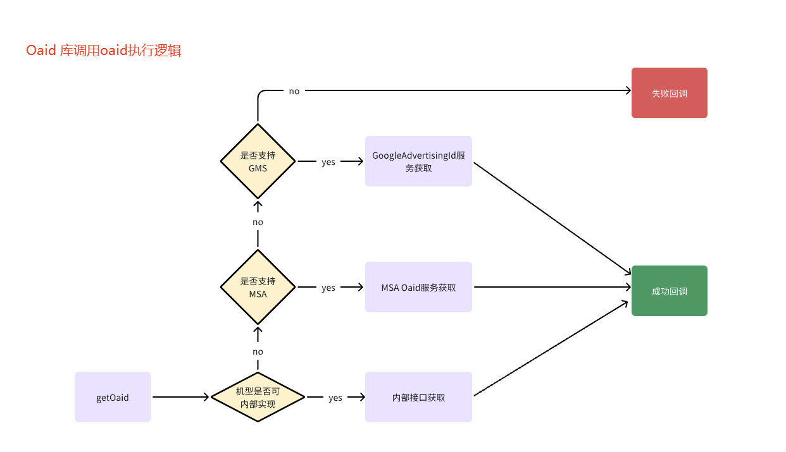

[//]: # (@formatter:off)

# Android_CN_OAID


安卓设备唯一标识解决方案，可作为移动安全联盟统一 SDK （miit_mdid_xxx.aar）的替代方案。
**注意，这个项目的初衷主要是针对个人开发者的APP，个人开发者没资格使用 MSA 的 SDK，企业的APP应该去申请使用 MSA 的 SDK**。
本项目提供了国内各大手机厂商获取 OAID（开放匿名设备标识）及海外手机平台获取 AAID（安卓广告标识）的便携接口，
另外也提供了 IMEI/MEID、AndroidID、PseudoID、GUID 等常见的设备标识的获取方法。

[](https://github.com/gzu-liyujiang/Android_CN_OAID/issues/110#issuecomment-3542804754)

- 震惊：从没想过之前的参考资料之一 https://github.com/2tu/msa 会被 MSA 举报，作为行业技术标准还兴搞技术垄断，要传播使用 MSA 的 SDK 真是一言难尽啊，参见 https://github.com/github/dmca/blob/master/2023/09/2023-09-21-msa.md 。
- 声明：本库虽然曾经逆向分析过 MSA 的 SDK ，但代码完全是原创的，是基于[北京数字联盟公开的代码](https://github.com/shuzilm-open-source/Get_Oaid_CNAdid)并结合第三方厂商公开或未公开的接口进行加工的，和 MSA 的 SDK 没有直接联系，不存在 `2tu/msa` 之类的侵权问题。根据北京数字联盟的声明，“……标准法的第二十二条规定：……禁止利用标准实施妨碍商品、服务自由流通等排除、限制市场竞争的行为。作为商用 ID 服务商，良性竞争能够让我们的产品变得更好……”，详见[请问该库商用有法律风险吗？](https://github.com/gzu-liyujiang/Android_CN_OAID/issues/50)

- GitHub：`https://github.com/gzu-liyujiang/Android_CN_OAID`
- 码云(GitEE)：`https://gitee.com/li_yu_jiang/Android_CN_OAID`
- Demo：[https://github.com/gzu-liyujiang/Android_CN_OAID/blob/master/demo.apk](/demo.apk)

## 接入指引

最新版本：[](https://jitpack.io/#gzu-liyujiang/Android_CN_OAID)
（[更新日志](/CHANGELOG.md) | [JavaDoc](https://gzu-liyujiang.github.io/Android_CN_OAID/)）

### 依赖配置

如果你的项目 Gradle 配置是在 7.0 以下，需要在 build.gradle 文件中加入：

```groovy
allprojects {
    repositories {
        // JitPack 远程仓库
        maven { url 'https://jitpack.io' }
    }
}
```
如果你的 Gradle 配置是 7.0 及以上，可能需要在 settings.gradle 文件中加入：

```groovy
dependencyResolutionManagement {
    repositories {
        // JitPack 远程仓库
        maven { url 'https://jitpack.io' }
    }
}
```

然后直接使用如下依赖即可：[](https://jitpack.io/#gzu-liyujiang/Android_CN_OAID)

```groovy
dependencies {
    implementation 'com.github.gzu-liyujiang:Android_CN_OAID:最新版本号'
}
```

除了依赖从 Github 拉取代码构建的包外，也可以依赖从码云构建的包：

```groovy
dependencies {
    implementation 'com.gitee.li_yu_jiang:Android_CN_OAID:最新版本号'
}
```

### 注意事项

- **4.2.5.1 版本以后直接使用了华为官方广告标识服务SDK，与移动安全联盟 SDK 共存** 的话可参考如下配置（PS：暂时没太多经历逆向华为的SDK重构包名来共存）：

```groovy
dependencies {
    implementation('com.github.gzu-liyujiang:Android_CN_OAID:最新版本号') {
        // 如果使用了较新版本的移动安全联盟SDK，共存的话可能需要排除掉本项目依赖的华为官方广告标识服务SDK，因为移动安全联盟SDK也依赖了华为的SDK
        //exclude group: 'com.huawei.hms', module: 'ads-identifier'
        // 荣耀官方广告标识服务SDK同理：      
        //exclude group: 'com.hihonor.mcs', module: 'ads-identifier'
    }
}

       // 如果华为官方广告标识服务SDK下载失败或编译报错的话，可考虑在 build.gradle 中增加以下配置：
        // repositories { maven { url 'https://developer.huawei.com/repo' } }
        // runtimeOnly "com.huawei.hms:ads-identifier:3.4.62.300"
        // 荣耀官方广告标识服务SDK同理：      
        // repositories { maven { url 'https://developer.hihonor.com/repo' } }
        // runtimeOnly "com.hihonor.mcs:ads-identifier:1.0.2.301"
```

- 自 **4.1.1** 开始默认加入了 `READ_PHONE_STATE`、`WRITE_SETTINGS`及`WRITE_EXTERNAL_STORAGE` 权限以便适配低版本安卓系统。 
- 为**遵循最小必要原则**保护用户隐私，若项目中没用到 IMEI 及 GUID，那么可酌情在 `AndroidManifest.xml` 中加入如下代码移除相关权限：

```xml
<manifest>
    <uses-permission android:name="android.permission.READ_PHONE_STATE" tools:node="remove" />
    <uses-permission android:name="android.permission.WRITE_SETTINGS" tools:node="remove" />
</manifest>
```

- **本库 4.1.1 至 4.1.3 之间的版本** ，若 Gradle 插件未指定 `targetSdkVersion 29+`，在 Android11+ 设备上可能会导致无法动态申请读写权限问题，参阅 [在权限里面加 maxSdkVersion 的用意](https://github.com/gzu-liyujiang/Android_CN_OAID/issues/25) 。
- **Gradle Plugin 4.0.0 及以下版本编译失败解决方案** ，参阅 [Missing 'package' key attribute on element package](https://github.com/gzu-liyujiang/Android_CN_OAID/issues/26) 。

### 代码示例

获取多个可能的设备标识，结合服务端引入[拜占庭容错方案](https://juejin.cn/post/6844903952148856839#heading-11)得到可靠的稳定的设备唯一标识：

- 第一步（可选的，用于调用 getClientId() 预取 OAID ）：

```text
    // 在`Application#onCreate`里初始化，注意APP合规性，若最终用户未同意隐私政策则不要调用
    @Override
    public void onCreate() {
        super.onCreate();
        if (privacyPolicyAgreed) {
            DeviceIdentifier.register(this);
        }
    }
```
- 第二步：

```text
         // 获取IMEI，只支持Android 10之前的系统，需要READ_PHONE_STATE权限，可能为空
        DeviceIdentifier.getIMEI(this);
        // 获取安卓ID，可能为空
        DeviceIdentifier.getAndroidID(this);
        // 获取数字版权管理ID，可能为空。很鸡肋，在某些手机上还可能造成卡死或闪退，自4.2.7版本后已弃用
        DeviceIdentifier.getWidevineID();
        // 获取伪造ID，根据硬件信息生成，不会为空，有大概率会重复
        DeviceIdentifier.getPseudoID()；
        // 获取GUID，随机生成，不会为空
        DeviceIdentifier.getGUID(this);
        // 是否支持OAID或AAID
        DeviceID.supportedOAID(this);
        // 获取OAID或AAID，同步调用
        DeviceIdentifier.getOAID(this);
        // 获取OAID或AAID，异步回调
        DeviceID.getOAID(this, new IGetter() {
            @Override
            public void onOAIDGetComplete(String result) {
                // 不同厂商的OAID/AAID格式是不一样的，可进行MD5、SHA1之类的哈希运算统一
            }

            @Override
            public void onOAIDGetError(Exception error) {
                // 获取OAID/AAID失败
            }
        });
        // 异步获取手机厂商专有的广告标识符，异步回调
        DeviceID.getByManufacturer(this, new IGetter() { ... });
        // 异步获取移动安全联盟通用的广告标识符，异步回调
        DeviceID.getByMsa(this, new IGetter() { ... });
        // 获取谷歌商店服务通用的广告标识符，异步回调
        DeviceID.getByGms(this, new IGetter() { ... });
        // 获取画布指纹
        DeviceIdentifier.getCanvasFingerprint();
```

## 混淆规则

本库自带`consumer-rules.pro`如下混淆规则，不混淆厂商的相关接口及类。若通过远程依赖的方式引用，则无需进行额外配置：

```proguard
# 本库模块专用的混淆规则（注：“repeackage”拼写是历史遗留问题）
-keep class repeackage.com.uodis.opendevice.aidl.** { *; }
-keep interface repeackage.com.uodis.opendevice.aidl.** { *; }
-keep class repeackage.com.asus.msa.SupplementaryDID.** { *; }
-keep interface repeackage.com.asus.msa.SupplementaryDID.** { *; }
-keep class repeackage.com.bun.lib.** { *; }
-keep interface repeackage.com.bun.lib.** { *; }
-keep class repeackage.com.heytap.openid.** { *; }
-keep interface repeackage.com.heytap.openid.** { *; }
-keep class repeackage.com.samsung.android.deviceidservice.** { *; }
-keep interface repeackage.com.samsung.android.deviceidservice.** { *; }
-keep class repeackage.com.zui.deviceidservice.** { *; }
-keep interface repeackage.com.zui.deviceidservice.** { *; }
-keep class repeackage.com.coolpad.deviceidsupport.** { *; }
-keep interface repeackage.com.coolpad.deviceidsupport.** { *; }
-keep class repeackage.com.android.creator.** { *; }
-keep interface repeackage.com.android.creator.** { *; }
-keep class repeackage.com.google.android.gms.ads.identifier.internal.** { *; }
-keep interface repeackage.com.google.android.gms.ads.identifier.internal.* { *; }
-keep class repeackage.com.oplus.stdid.** {*; }
-keep interface repeackage.com.oplus.stdid.** {*; }
-keep class com.huawei.hms.ads.** {*; }
-keep interface com.huawei.hms.ads.** {*; }
-keep class com.hihonor.ads.** {*; }
-keep interface com.hihonor.ads.** {*; }
-keep class repeackage.com.qiku.id.** { *; }
-keep interface repeackage.com.qiku.id.** { *; }
```

## 支持情况

| 厂商或品牌                        | 系统或框架                                              |
| --------------------------------- | ------------------------------------------------------- |
| 华为（Huawei）                    | HMS Core 2.6.2+、Google Play Service 4.0+               |
| 荣耀（Honor）                     | Magic UI 4/5/6、MagicOS 7.0+、Google Play Service 4.0+  |
| 小米（XiaoMi、Redmi、BlackShark） | MIUI 10.2+、Google Play Service 4.0+                    |
| 维沃（VIVO、IQOO）                | Funtouch OS 9+、OriginOS 1.0+、Google Play Service 4.0+ |
| 欧珀（OPPO、Realme）              | ColorOS 7.0+、Google Play Service 4.0+                  |
| 三星（Samsung）                   | Android 10+、Google Play Service 4.0+                   |
| 联想（Lenovo）                    | ZUI 11.4+、Google Play Service 4.0+                     |
| 华硕（ASUS）                      | Android 10+、Google Play Service 4.0+                   |
| 魅族（Meizu）                     | Android 10+、Google Play Service 4.0+                   |
| 一加（OnePlus）                   | Android 10+、Google Play Service 4.0+                   |
| 努比亚（Nubia）                   | Android 10+、Google Play Service 4.0+                   |
| 酷派（Coolpad）                   | CoolOS、Google Play Service 4.0+                        |
| 酷赛（Coosea ）                   | Android 10+、Google Play Service 4.0+                   |
| 卓易（Droi ）                     | Freeme OS、Google Play Service 4.0+                     |
| 其他（ZTE、HTC、Motorola、……）    | SSUI、Google Play Service 4.0+                          |

> 注：本项目的 OAID 获取接口主要参考北京数字联盟公开的代码以及逆向分析参考移动安全联盟的 SDK、HUAWEI Ads SDK、小米 DeviceId.jar、Google Play Services SDK 等。

## 效果预览

### OAID（开放匿名设备标识符）

- 华为手机 
- 荣耀手机 
- 小米手机 
- 红米手机 
- 黑鲨手机 
- 维沃手机 
- 欧珀手机 
- 真我手机 
- 三星手机 
- 魅族手机 
- 联想手机 
- 一加手机 
- 华硕手机 
- 努比亚机  `待验证`
- 酷派手机  `待验证`
- 酷赛手机  `待验证`
- 卓易手机  `待验证`

### AAID（安卓广告标识符）

- 谷歌手机 
- 中兴手机 
- 摩托罗拉 
- 索尼手机 
- 诺基亚机 
- HTC 手机 
- LG 手机 

### 不支持 OAID 或 AAID

- 用户关闭了广告标识符


- 以下厂商或品牌手机截止`2021年8月26日`已验证尚不支持：


```text
锤子（Smartisan）、360（360）、奇酷（QiKu）、海信（Hisense）、金立（Gionee）、
美图（Meitu）、糖果（SOAP）、格力（Gree）、朵唯（Doov）、优思（Uniscope）、
夏普（SHARP）、乐视（LeTV）、维图（VOTO）、宏碁（Acer）、TCL（TCL）、……
```

## 参考资料

OAID 是移动智能终端补充设备标识体系中的一员，官方定义为 Open Anonymous Device Identifier（开放匿名设备标识符），
华为称之为 Open Advertising  ID （开放广告标识符），谷歌称之为 Android Advertising ID （安卓广告标识符）。

- 逆向分析还原的 [手机厂商开放匿名设备标识符获取接口(AIDL)](https://github.com/gzu-liyujiang/Android_CN_OAID/tree/master/aidl) 。
- [2tu/msa 提供的移动安全联盟统一 SDK 下载](https://github.com/2tu/msa) （download from `https://www.msa-alliance.cn/col.jsp?id=120` 这个存储库因版权问题被MSA举报了，参见 [DMCA 2023-09-21-msa](https://github.com/github/dmca/blob/master/2023/09/2023-09-21-msa.md) 。
- 谷歌官方文档 [使用标识符的最佳做法](https://developer.android.google.cn/training/articles/user-data-ids) 。
- [团体标准-移动智能终端补充设备标识规范-v20190516.pdf](https://swsdl.vivo.com.cn/appstore/developer/uploadfile/20191109/uohz59/%E5%9B%A2%E4%BD%93%E6%A0%87%E5%87%86-%E7%A7%BB%E5%8A%A8%E6%99%BA%E8%83%BD%E7%BB%88%E7%AB%AF%E8%A1%A5%E5%85%85%E8%AE%BE%E5%A4%87%E6%A0%87%E8%AF%86%E8%A7%84%E8%8C%83-v20190516.pdf) 。
- 华为 [广告标识服务](https://developer.huawei.com/consumer/cn/doc/development/HMSCore-Guides/identifier-service-version-change-history-0000001050066927) 。
- 荣耀 [广告标识服务](https://developer.hihonor.com/cn/kitdoc?kitId=11030&navigation=guides&docId=update-instructions.md&token=) 。
- 小米 [设备标识体系说明](https://dev.mi.com/console/doc/detail?pId=1821) 。
- 魅族 [移动智能终端补充设备标识](http://open-wiki.flyme.cn/doc-wiki/index#id?133) 。
- 维沃 [移动智能终端补充设备标识服务](https://dev.vivo.com.cn/documentCenter/doc/253) 。
- 欧珀 [移动智能终端补充设备标识体系](https://open.oppomobile.com/wiki/doc#id=10608) 。
- 三星 [适配指导 | Android Q Device ID 权限变更](https://support-cn.samsung.com/App/DeveloperChina/notice/detail?noticeid=115) 。
- 北京数字联盟公开的获取各厂商 OAID  的代码：[Get_Oaid_CNAdid](https://github.com/shuzilm-open-source/Get_Oaid_CNAdid)。
- 获取或生成设备唯一标识后，推荐参考“[一种 Android 移动设备构造 UDID 的方案](https://github.com/No89757/Udid) ” 。
- StackOverFlow [Is there a unique Android device ID ?](https://stackoverflow.com/questions/2785485/is-there-a-unique-android-device-id) 。

## 远程真机

- 免费 [华为远程真机云调试](https://developer.huawei.com/consumer/cn/agconnect/cloud-adjust) 。
- 免费 [荣耀远程真机云调试](https://developer.hihonor.com/cn/doc/guides/100194) 。
- 免费 [小米云测平台远程真机租用](https://testit.miui.com/remote) 。
- 免费 [维沃云测平台远程真机](https://vcl.vivo.com.cn/#/machine/picking) 。
- 免费 [欧珀云测平台远程真机](https://open.oppomobile.com/cloudmachine/device/list-plus) 。
- 免费 [三星远程开发测试平台真机调试](http://samsung.smarterapps.cn/index.php?app=home&mod=Index&act=samsung) 。
- 新人试用 ~~腾讯 WeTest 云真机调试、阿里 EMAS 移动测试远程真机、百度 MTC 远程真机调试、Testin 远程真机测试、AllTesting 真机测试~~ 。

## 许可协议

```text
Copyright (c) 2016-present. gzu-liyujiang<1032694760@qq.com> and All Contributors.

The software is licensed under the Mulan PSL v2.
You can use this software according to the terms and conditions of the Mulan PSL v2.
You may obtain a copy of Mulan PSL v2 at:
    http://license.coscl.org.cn/MulanPSL2
THIS SOFTWARE IS PROVIDED ON AN "AS IS" BASIS, WITHOUT WARRANTIES OF ANY KIND, EITHER EXPRESS OR
IMPLIED, INCLUDING BUT NOT LIMITED TO NON-INFRINGEMENT, MERCHANTABILITY OR FIT FOR A PARTICULAR
PURPOSE.
See the Mulan PSL v2 for more details.
```
## IDE 推荐

支持开源，除了 Intellij IDEA Community / PyCharm  Community 和 EAP 版本可免费使用，也可通过 [申请开源开发许可证](https://www.jetbrains.com/shop/eform/opensource) 来免费使用正版的 [JetBrains 全家桶开发工具](https://www.jetbrains.com.cn/products/)，尤其是 Intellij IDEA Ultimate 版本很强大。

